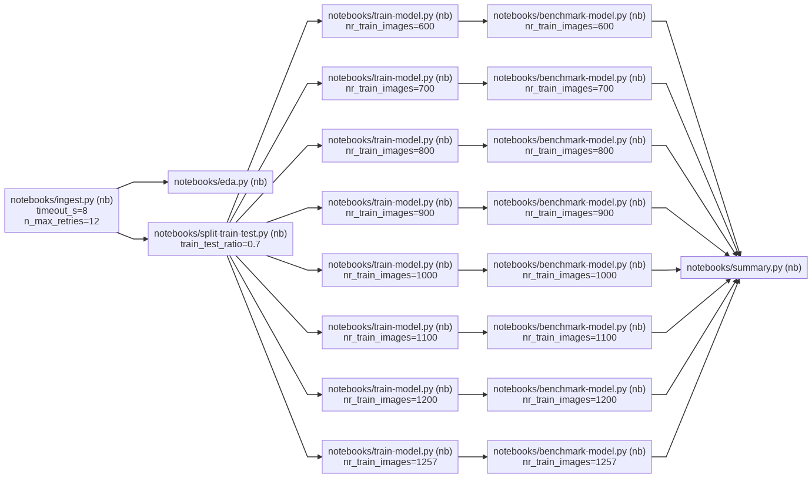

# `pynb-dag-runner` Python library

> **py_dag_runner** is a light-weight open source Python library for running pipelines of Python functions and/or Jupter notebooks.

Main features:

### Tasks are executed in parallel using the Ray framework
 - With a DAG one can define in which order tasks should run.
 - Tasks run in parallel using the Ray framework (subject to DAG constraints).

### Reporting

After a pipeline has run, `py_dag_runner` stores outputs from all tasks in the pipeline to a directory structure. This includes:

- Evaluated notebooks in both `.ipynb` and `.html` formats.
- Parameters used to trigger tasks.
- Timing and other outcomes (eg., did a task fail, succeed, or timeout).

An implication of storing output as files is that `py_dag_runner` is independent of any external service, database, or infrastructure. Eg., if `py_dag_runner` is used to run a pipeline in a CI-setup all outputs can be saved as build-artefacts.

A limitation of this approach is that there is no real-time monitoring. For interactive viewing, output files can be inspected with a file viewer. Or, alternatively, artefacts can be uploaded to ML Flow for off-line inspection.

###  Demo pipeline, see [mnist-digits-demo-pipeline](https://github.com/pynb-dag-runner/mnist-digits-demo-pipeline) repo



## Notes

Jupyter notebooks are assumed to be in Jupytext format. That means:

1. Notebooks are stored (in git) as ordinary Python text files that can be version controlled and reviewed in pull requests.
2. Unlike ipynb files, Jupytext notebooks can not contain data cells (with images or tables).
3. Notebooks are run with the Papermill library [link](https://papermill.readthedocs.io/en/latest/), and notebooks can therefore also depend on parameters.

With the [Jupytext format](https://jupytext.readthedocs.io/en/latest/formats.html), notebooks can be linted (using black) and type checked (using mypy), see demo pipeline linked above for an example of this.

The [Ray framework](https://www.ray.io/) supports execution on a Ray cluster of multiple nodes, but currently `py_dag_runner` only supports single node setups.

----

## Development setup

The below VS Code/Docker based setup has been tested on Linux (Kubuntu), but should also work on MacOS with minor changes. For more details, see VS Code remote development [link](https://code.visualstudio.com/docs/remote/remote-overview).

### In VS Code
- Open the root of this repository in VS Code.
- In the repo root run `make docker-build-all`.
- Ensure that the extension "Remote - Containers" (`ms-vscode-remote.remote-containers` published by Microsoft) is installed.
- Press the `><`-button in the lower left VS Code window corner. Select "Reopen in container".
- Inside container ensure that the "Python" extension is installed (`ms-python.python` also published by Microsoft) if it is not automatically installed. When installed and enabled, the lower row will show the Python version in use inside the container.
- To start tests (unit tests, black, and mypy) in watch mode, start the task "pynb_dag_runner library - watch and run all tasks" (`Ctrl` + `Shift` + `P`).

### Run tests and build Python wheel file

```bash
make docker-build-all
make [test|build|clean]
```

## Contact

Please note that this is experimental and 🚧🚧🚧🚧.

A motivation for this work is to make it easier to set up and work together (on pipelines). If you would like to discuss an idea or question, please raise an [issue](https://github.com/pynb-dag-runner/mnist-digits-demo-pipeline/issues) or contact me via email.

## License

(c) Matias Dahl 2021, MIT, see [LICENSE.md](./LICENSE.md).
