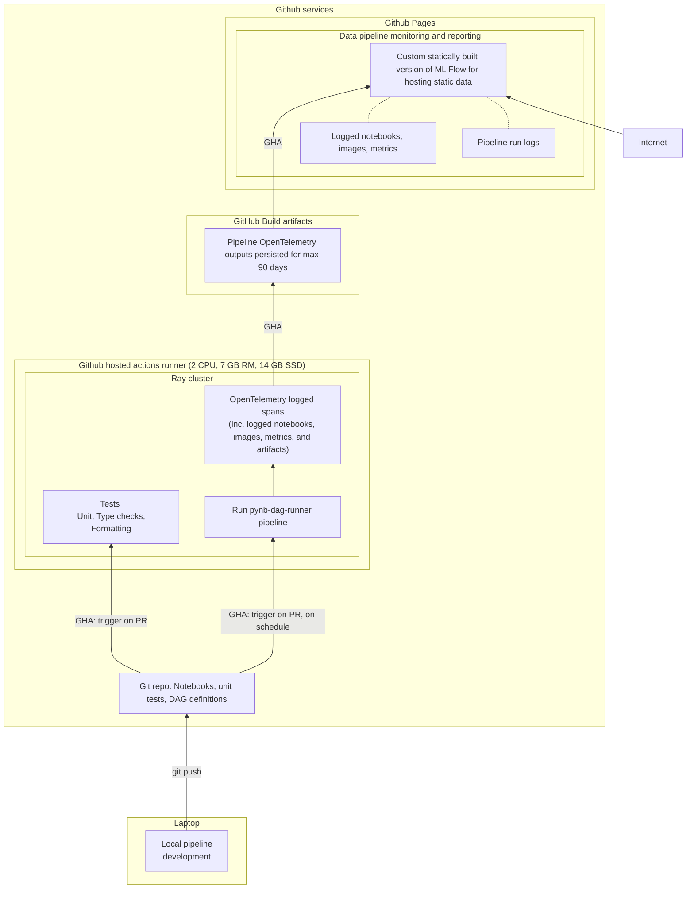

# `pynb-dag-runner`
## Overview and motivation

**py_dag_runner** is an OSS Python library for running DAGs -- or pipelines -- of Python notebooks on a Ray
cluster with OpenTelemetry logging. For reporting and experiment tracking, the OpenTelemetry
logs can be converted into a static website. This is accomplished using a custom fork of MLFlow
that builds static websites that can be deployed without an API backend.

Thus, **py_dag_runner** can run (small scale data) pipelines
using only services provided with a free Github account:
- Github Actions: for scheduling and compute
- Github build artifacts: to persists OpenTelemetry logs of pipeline runs
- Github Pages: to host MLFlow-based static reporting site

**py_dag_runner** includes a demo pipeline that illustrates this setup:

### Demo `mnist-digits-demo-pipeline` pipeline running on Github infrastructure
- Demo reporting site: **https://pynb-dag-runner.github.io/mnist-digits-demo-pipeline/**
- This read-only static site is hosted on Github Pages. It is built using a modified version of MLFlow and does not use a backend.
- The site reports (eg logged metrics, artifacts, rendered notebooks) for:
  - pipeline runs scheduled to run daily
  - pipeline runs triggered by pull requests
- See the below diagrams for more details

### Demo pipeline DAG

The pipeline explores how size of training set influences model performance.

### Demo pipeline architecture

The below shows in more detail how Github services are used:

## Key repositories

There are three repos:
### [pynb-dag-runner/mnist-digits-demo-pipeline](https://github.com/pynb-dag-runner/mnist-digits-demo-pipeline)
 - Repo for the mnist demo pipeline (Python, notebooks, GHA definitions)

### [pynb-dag-runner/pynb-dag-runner](https://github.com/pynb-dag-runner/pynb-dag-runner)
 - Repo for the main library (Python, Ray, OpenTelemetry). This is used when running the demo pipeline.

### [pynb-dag-runner/mlflow](https://github.com/pynb-dag-runner/mlflow).
 - A slightly modified version of MLFlow, that can build static MLFlow-like sites where all metadata is included in the front end.
 - The demo site linked [above](https://pynb-dag-runner.github.io/mnist-digits-demo-pipeline) is built using this repo.

## Main features and dependencies

**py_dag_runner** is a open source Python library for running pipelines of Jupter notebooks
or Python functions.

### (Notebook) tasks are executed in parallel using the [Ray](https://www.ray.io/) framework
 - With a DAG one can define in which order tasks should run.
 - Tasks can run in parallel (subject to DAG constraints).
 - Currently `pynb-dag-runner` only support single node Ray clusters.

### Pipeline outputs are saved using the [OpenTelemetry](https://opentelemetry.io/) standard
- Pipeline telemetry is emitted using the OpenTelemetry (open) standard. This includes:
  - Pipeline configuration.
  - Parameters used to trigger tasks/notebooks.
  - Any logged images, metrics, rendered notebooks, or even models.
  - Timing and other outcomes (eg., did a task fail, succeed, timeout, retries).
- Effectively, this means that after a pipeline has run all relevant information can be stored as one json file. Alternatively, this can be expanded into a directory structure, or the events can be redirected into any service that support OpenTelemetry (span events).
- Use of OpenTelemetry is possible since Ray supports OpenTelemetry.

### Reporting using custom static version of [MLFlow](https://mlflow.org/)
- OpenTelemetry files emitted from pipeline runs can be converted into a static website (built using a custom version of mlflow).
- See [demo hosted on Github Pages](https://pynb-dag-runner.github.io/mnist-digits-demo-pipeline/).
- A limitation with a static website is that reporting is not real time.

----

See [docs/NOTES.md](docs/NOTES.md) for further comments about the implementation and dependencies.

## Local development
Development environments are dockerized, and makefile:s should be available for most common tasks. See:

- [docs/LOCAL_UI_DEV.md](docs/LOCAL_UI_DEV.md): local development for developing mlflow frontend with static data

- [docs/LOCAL_DEV.md](docs/LOCAL_DEV.md): local development of main `pynb_dag_runner` Python library

The Github actions in the `pynb-dag-runner` and `mnist-digits-demo-pipeline` repos can also be useful since they show how various tests (unit, static code analysis) and pipelines are run in docker.

Instructions assume linux-based setup (eg. ubuntu), but should also work on macs with some changes (or at least on non-M1 ones).

## Ideas, feedback and contributions welcome

This is WIP and all feedback is welcome.

To contribute, the best way is likely to first open an issue or send an email.

#### Motivation
- Develop more options for working together on (small scale) open source/open data pipelines
- Experiment how MLOps can scale down to a minimum setup
- Learning

## License
(c) Matias Dahl 2021-2022, MIT, see [LICENSE.md](./LICENSE.md).
