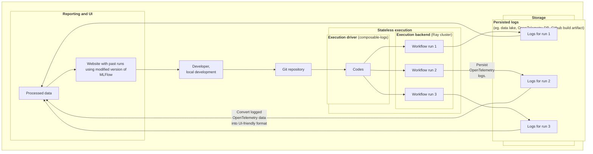
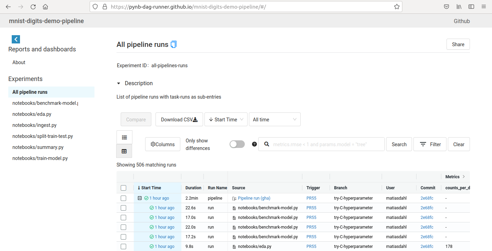

---
hide:
  #- navigation
  - toc
---

# What is `Composable Logs`?

**Composable Logs** is an open source Python framework for running Python ML/data workflows.

A main feature of Composable Logs is that workflows can execute on stateless compute infrastructure (that may be ephemeral, serverless).
So, a 24/7 running database or service to record past runs or metrics is not needed.
Rather, when Composable Logs executes a workflow, all key events (and logged artifacts) are emitted using the [OpenTelemetry standard:material-launch:](https://opentelemetry.io/).
Thus, after a workflow has completed, an immutable record of the run can be persisted as a JSON file to a data lake (as one storage option).

For reporting and experiment tracking, the structured logs can be converted into various formats.
Currently, Composable Logs can convert logs into a static website that can be deployed eg. to Github Pages.

## Open source

Composable Logs is distributed under the terms of the MIT license, see [repo](https://github.com/composable-logs/composable-logs) for details.

There are two main dependencies:

#### The [Ray framework:material-launch:](https://www.ray.io/ray-core) for parallel execution of Python tasks (open source)
Ray makes it possible to develop and test code locally on a laptop. And the same code also scales up to large Ray clusters with multiple nodes. Ray natively supports cluster setup on AWS, Azure, GCP and Kubernetes, see  [details:material-launch:](https://docs.ray.io/en/latest/cluster/deploy.html).

More in detail, Composable Logs uses Ray Workflows. These are essentially DAG:s of Python tasks, but
Ray Workflows also support more advanced patterns like computational DAG:s being created dynamically at runtime, or task recursion. As of 1/2023, Ray Workflows is still an alpha feature, see [documentation](https://docs.ray.io/en/latest/workflows/index.html).

!!! info
    Currently, all example usages of Composable Logs are static DAG:s and in this documentation we use pipeline and workflow almost interchangeably. However, with workflow we emphasize that a pipeline is implemented (or executed) as a Ray workflow and could potentially be more involved than a static DAG.

    As of 1/2023: some modifications would be expected for Composable Logs to execute workflows on multinode clusters, or to implement non-static DAGs.

#### The [OpenTelemetry:material-launch:](https://opentelemetry.io) for observability and logging task execution details (open standard)

- OpenTelemetry is an open standard and an CNCF incubating project.
- Broad support from various vendors, [list](https://opentelemetry.io/ecosystem/vendors/). In particular, the main clouds (Azure, AWS, Google Cloud) all support ingestion of OpenTelemetry logs (with different levels of support of the standard).
- OpenTelemetry [steering group](https://github.com/open-telemetry/community/blob/main/community-members.md) include broad industry representation.

A motivation to use an open standard to ingest ML/data log data is that this opens option to potentially correlate this data with system metrics (is this feasible?). Eg.,

- To troubleshoot a failed data ingestion task, it can be useful to view its network input/output.
- Before deploying a long running ML-training job, it might be useful to monitor GPU/CPU loads. Eg. is it 10% or 90%.

## Example architecture

## Demo ML training workflow

One motivation for developing Composable Logs is to have a framework to run workflows on limited or no cloud infrastructure.
The [Demo workflow](../live-demos/mnist-digits-demo-pipeline/)-section in this documentation describe in more detail
how one eg. deploy and run a workflow using only services provided with a (free, personal) Github account.

<figure markdown>
  [{ width="800"}](https://composable-logs.github.io/mnist-digits-demo-pipeline/)
  <figcaption>
  <b><a href="https://composable-logs.github.io/mnist-digits-demo-pipeline/">
  https://composable-logs.github.io/mnist-digits-demo-pipeline/
  </a></b>
  </figcaption>
  <figcaption>
  Demo workflow: Public task and experiment tracker on Github Pages.
  The UI is based on a forked version of the MLFlow that can be deployed as a static website.
  </figcaption>
</figure>

## Use cases and scope

- Composable Logs can currently run public data/ML pipelines using only services provided with a (free, personal) Github account.
  Since this can be scheduled to run daily, one could:

    - Run (smaller scale) public data pipelines that process and report on open data.
    - Showcase how to use a library with a publicly running pipeline.

- Improve the tooling to collaborate on notebooks and public open source data and ML pipelines.
- Offer example pipeline(s) exploring how ML Ops can scale down to minimum "free tier" setups.
- Reproducible science: schedule the analysis for a paper to run eg. every month, potentially with updated dependencies.

## Status

The project is already usable, but not for critical workloads.

[Feedback, ideas and contributions welcome!](../contact)
