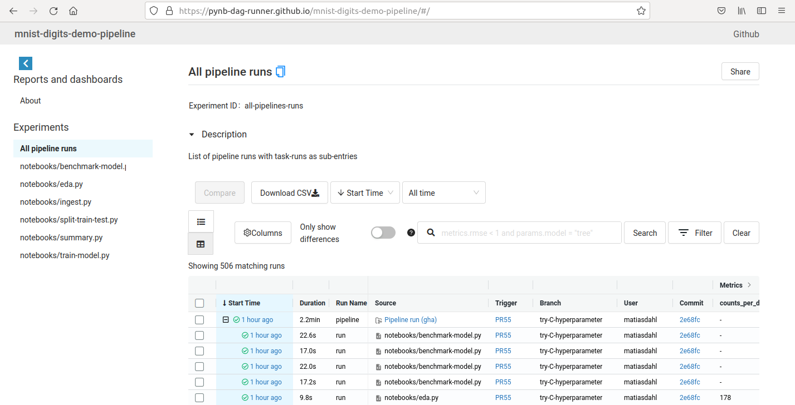
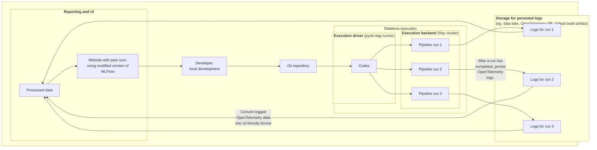

---
hide:
  #- navigation
  - toc
---

# What is `pynb-dag-runner`?

**`pynb-dag-runner`** is an open source Python framework for running Python (notebook) ML/data pipelines.

A main feature of `pynb-dag-runner` is that pipelines can execute on stateless compute infrastructure (that may be ephemeral, serverless).
So, a 24/7 running database or service to record past runs or metrics is not needed.
Rather, when `pynb-dag-runner` executes a pipeline, all key events (and logged artifacts) are emitted using the [OpenTelemetry standard:material-launch:](https://opentelemetry.io/).
Thus, after a pipeline has completed, an immutable record of the run can be persisted as a JSON file to a data lake (as one storage option).

For reporting and experiment tracking, the structured logs can be converted into various formats.
Currently, `pynb-dag-runner` can convert logs into a static website that can be deployed eg. to Github Pages.

## Demo ML training pipeline

A main motivation for developing `pynb-dag-runner` is to have a framework to run pipelines on limited or no cloud infrastructure.
The [Demo pipeline](../live-demos/mnist-digits-demo-pipeline/)-section in this documentation describe in more detail
how one eg. deploy and run a pipeline using only services provided with a (free, personal) Github account.

<figure markdown>
  [{ width="800"}](https://pynb-dag-runner.github.io/mnist-digits-demo-pipeline/)
  <figcaption>
  <b><a href="https://pynb-dag-runner.github.io/mnist-digits-demo-pipeline/">
  https://pynb-dag-runner.github.io/mnist-digits-demo-pipeline/
  </a></b>
  </figcaption>
  <figcaption>
  Demo pipeline: Public task and experiment tracker on Github Pages.
  The UI is based on a modified version of the MLFlow.
  </figcaption>
</figure>

## Architecture for `pynb-dag-runner` pipelines

!!! info
    The task execution framework for `pynb-dag-runner` is built using the [Ray framework:material-launch:](https://www.ray.io/ray-core), and pipeline tasks can run in parallel.
    Ray does have support for larger clusters (with support for public clouds and Kubernetes, [details:material-launch:](https://docs.ray.io/en/latest/cluster/deploy.html)).
    However, execution on multi-node Ray clusters is not supported by `pynb-dag-runner` (at least yet).

!!! info
    On use of OpenTelemetry: When pipelines are logged with OpenTelemetry, they could potentially be correlated with other (system) metrics. Eg.

    - To troubleshoot a failed data ingestion task, it can be useful to view its network input/output.
    - Before deploying a long running ML-training job, it might be useful to monitor GPU/CPU loads. Eg. is it 10% or 90%.

    Details on this would need to be investigated, tbd. Is this feasible?

## Use cases and scope

- `pynb-dag-runner` can currently run public pipelines using only services provided with a (free, personal) Github account.
  Since this can be scheduled to run daily, one could:

    - Run (smaller scale) public data pipelines that process and report on open data.
    - Showcase how to use a library with a publicly running pipeline.

- Improve the tooling to collaborate on notebooks and public open source pipelines.
- Offer example pipeline(s) exploring how MLOps can scale down to minimum "free tier" setups.
- Reproducible science: schedule the analysis for a paper to run eg. every month, potentially with updated dependencies.

## Status

This is work in progress (and even the name `pynb-dag-runner` might change :smile:).

The project is already usable, but not for critical workloads.

[Feedback, ideas and contributions welcome!](../contact)
