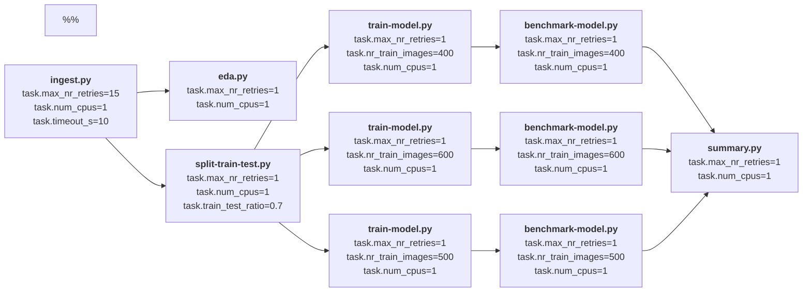
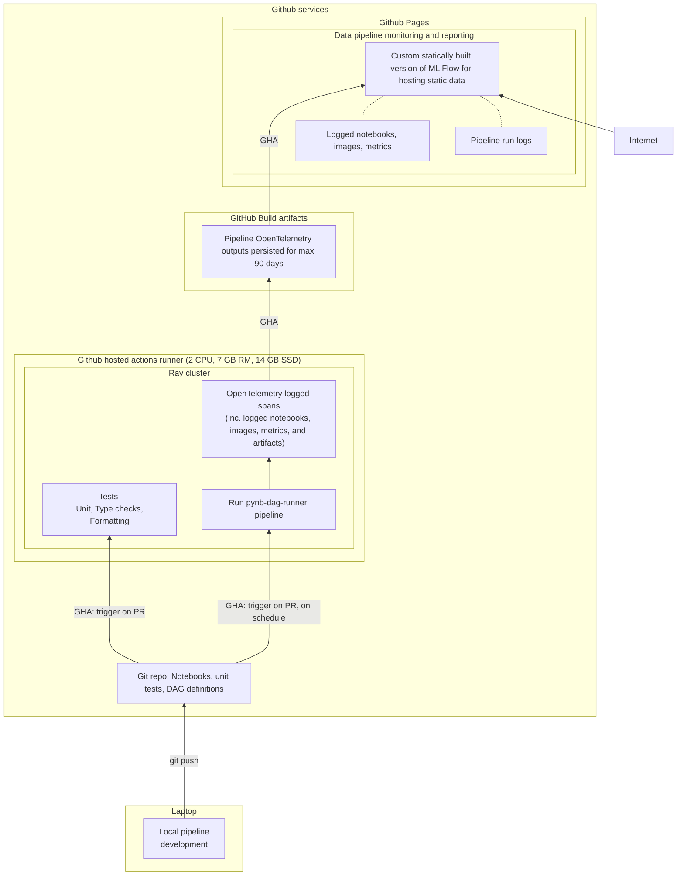

---
hide:
  #- navigation
  - toc
---

A main goal of `pynb-dag-runner` is to make it easy to deploy data/ml pipelines with no (or with minimal) cloud infrastructure.

Currently there is one live demo pipeline `mnist-digits-demo-pipeline` illustrating this in practice.

## Demo pipeline: `mnist-digits-demo-pipeline`

**Public experiment tracker (hosted on Github Pages):** [https://pynb-dag-runner.github.io/mnist-digits-demo-pipeline<sup><sup><sub>:material-launch:</sub></sup></sup>](https://pynb-dag-runner.github.io/mnist-digits-demo-pipeline/)

<figure markdown>
  [{ width="800"}](https://pynb-dag-runner.github.io/mnist-digits-demo-pipeline/)
</figure>

**Code repo:** [https://github.com/pynb-dag-runner/mnist-digits-demo-pipeline<sup><sup><sub>:material-launch:</sub></sup></sup>](https://github.com/pynb-dag-runner/mnist-digits-demo-pipeline)

### Main features

- [x] The pipeline is scheduled to run every day and for all pull requests to the repo.
- [x] The pipeline runs without any cloud infrastructure, and pipeline uses only services provided with a (free personal) public Github account:
       - Use **Github Actions** for compute resources, and for orchestration.
       - Use **Github Build Artifacts** for storing pipeline run logs.
       - Use **Github Pages** for pipeline/task tracker and ML-experiment tracker
         (hosted as a static site and built from pipeline run logs).
- [x] Outcomes of pipeline runs (both scheduled- and PR- pipeline runs) can be inspected in the Experiment tracker (see above, this is hosted as a static website and build using a fork of MLFlow).

This setup could be used to run public open source -- open data pipelines using only a free personal Github account.
### Pipeline task DAG

This pipeline trains a model for recognizing hand written digits from a toy MNIST data set included in sklearn library.

As shown below, the pipeline explores how performance depends on the size of the training set.



### Architecture and use of Github services

A special feature of the below architecture is that each run of the pipeline can be executed serverless using ephemeral compute resources.
So, after a pipeline has run, we only need to persist the (OpenTelemetry) logs of that run, and those are stored as one immutable JSON file per pipeline run.

In other words, the architecture does not include any tracking servers that need to run 24/7 (eg. for task execution, like Airflow) or for experiment tracking (eg. for ML tracking, like an MLFlow backend).
In particular, the architecture does not include any databases.



!!! info
    The demo does not deploy the trained model as an REST API, but the trained model is saved in ONNX format. Thus, it could eg. be included into a website.


### Run the pipeline locally

``` bash
git clone --recurse-submodules git@github.com:pynb-dag-runner/mnist-digits-demo-pipeline.git

cd mnist-digits-demo-pipeline
make docker-build-all

make clean

# run
# - unit, type and linter tests
# - pipeline in dev-mode
make test-and-run-pipeline
```

**Notes**

- After the pipeline has run, results and outputs can be inspected in the `pipeline-outputs`-directory.
- For further details, please see the [mnist-digits-demo-pipeline](https://github.com/pynb-dag-runner/mnist-digits-demo-pipeline) repo.
- In the above, `make test-and-run-pipeline` is currently slow.
  Please see [Next steps](../next-steps/) for plans to address this.

### Notes and possible limitations
- Compute resources provided for free by Github are limited. This could be improved with a more powerful self-hosted runner.
- The demo pipeline run logs are published as build artifacts to a public repo.
    - Thus, if any secrets are used in the pipeline, this require special care.
    - For public Github repos, build artifacts have maximum retention period of 90 days.
- The Experiment tracker UI is a public website. Making the website private requires a premium [Github subscription](https://docs.github.com/en/enterprise-cloud@latest/pages/getting-started-with-github-pages/changing-the-visibility-of-your-github-pages-site).

These limitations could be addressed by introducing cloud infrastructure and customization.
On the other hand, in that case there are also many other options.
